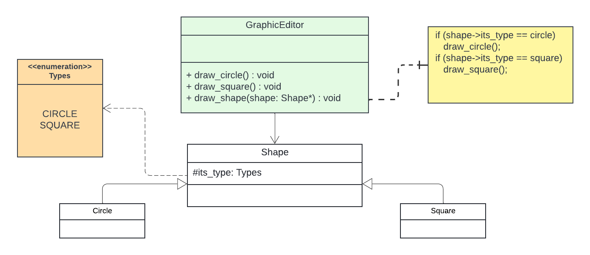
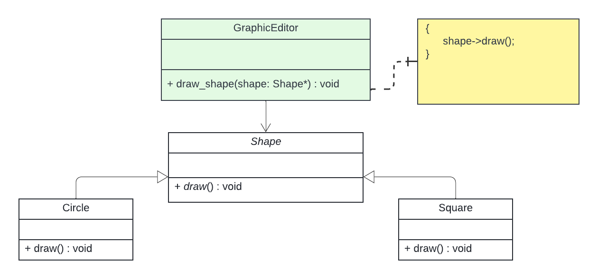
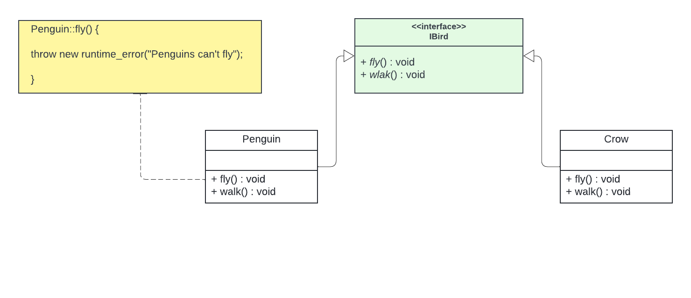
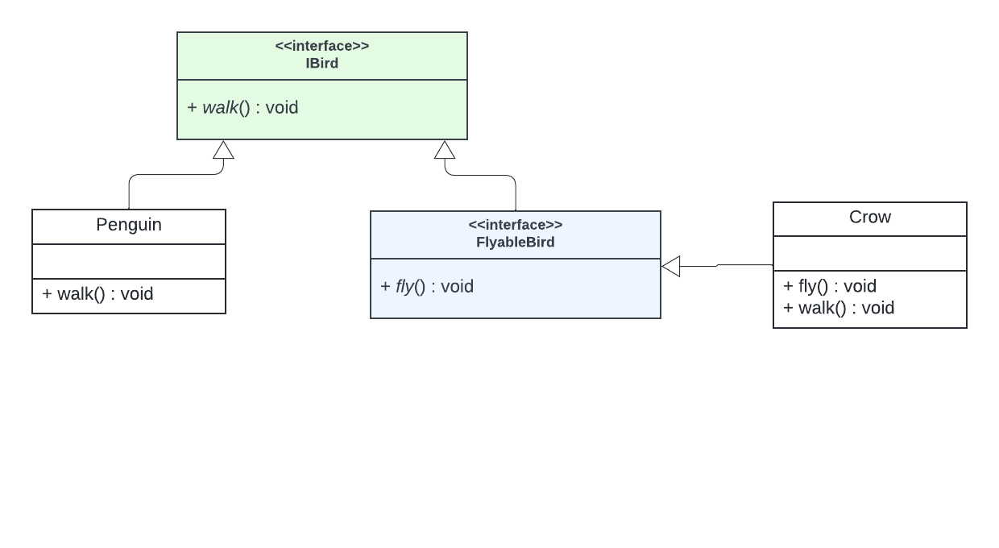

# SOLID principles
SOLID is a set of rules, or guidelines, that allow you to produce code that is easier to read, understand and maintain.

Each letter in the word SOLID refers to a specific rule:
<ul>
<li>[S]ingle Responsibility Principle</li>
<li>[O]pen/Closed Principle</li>
<li>[L]iskov Substitution Principle</li>
<li>[I]nterface Segregation Principle</li>
<li>[D]ependency Inversion Principle</li>
</ul>

By following these principles, developers can create more flexible and modular software. It also reduces the coupling between different parts of the software, making it easier to maintain and evolve the code. The `SOLID` principles are therefore an essential tool for programmers who want to create high-quality, scalable and maintainable software.

So let explore these princiles
<hr>

SOLID PRINCIPLES

 ➡️ Single Responsibility
    Each class should have only one sole purpose,
    and not be filled with excessive functionality

 ➡️ Open Closed
    Classes should be open for extension,
    closed for modification. In other words, you should not have to rewrite
    an existing class for implementing new features.

 ➡️ Liskov Substitution
    This means that every subclass or
    derived class should be substitutable for their
    base or parent class

 ➡️ Interface Segregation
    Interfaces should not force classes to implement
    what they can’t do.
    Large interfaces should be divided into small ones.

 ➡️ Dependency Inversion
    Components should depend on abstractions,
    not on concretions.

<hr>
<h1>Single Responsibility</h1>
....
<!-- <hr> -->
<h1><a href="https://www.oodesign.com/open-closed-principle">Open Closed</a></h1>
Software is made for solving a specific problem or meeting specific requirements in the real world and there is always a huge chance that the requirements will change. Software is abstract and changeable. Considering this important aspect, we developers should take it with responsibility every time when we build any project, which includes the adoption of techniques that allows us to have a code structure that minimizes the chances to introduce new bugs in the cases when the business requirement changes.

One of these possible techniques is the use of the Open-Closed Principle, which states that **a class/object should be open to extension but close for modification**.
This principle aims to extend a Class’s behaviour without changing the existing behaviour of that Class. This is to avoid causing bugs wherever the Class is being used.
<br>

## Exmaple which violates the OCP



```c++
// Shapes type enumeration
enum Types {
   CIRCLE,
   SQUARE,
}

class GraphicEditor {
private:
   /*data*/

public:
   void  draw_circle(); // implemented elsewhere.
   void  draw_square(); // implemented elsewhere.

   void  draw_shape(Shape *shape)
   {
      if (shape->its_type == CIRCLE)
         draw_circle();
      else if (shape->its_shape == SQUARE)
         draw_square();
   }
};

class Shape {
protected:
   Types its_type;
};

class Square : Shape {
   // Some data and behaviors
};

class Circle : Shape {
   // Some data and behaviors
};


int   main() {

}

```
This code example demonstrates a violation of the Open-Closed Principle. The `GraphicEditor` class must be modified to accommodate new shapes, such as a rectangle. This not only requires additions to the `Types` enumeration but also necessitates changes within the `GraphicEditor` class, introducing (fragility) a risk of bugs as the project complexity increases. Adopting the OCP from the outset helps maintain a more resilient and extensible codebase.

<br>

## Example that adhere to OCP


```c++
class GraphicEditor {
private:
   /*data*/

public:
   void  draw_shape(Shape *shape)
   {
      shape->draw();
   }
};

class Shape {
public:
   virtual void  draw() = 0;
};

class Square : Shape {
   void  draw() {
      // ....
   }
};

class Circle : Shape {
   void  draw() {
      // ....
   }
};


int   main(void) {

}   
```
This design exemplifies adherence to the Open-Closed Principle by utilizing an abstract `draw()` method, which is invoked within the `GraphicEditor` class to draw various shapes. *The actual implementation of drawing each shape is encapsulated within their respective concrete shape classes*.

By adhering to the Open-Closed Principle, the drawbacks encountered in the previous design are avoided. Notably, **the GraphicEditor class remains unchanged even with the addition of new shape classes**.

A clever application design and the code writing part should take care of the frequent changes that are done during the development and the maintaining phase of an application. Usually, many changes are involved when a new functionality is added to an application. Those changes in the existing code should be **minimized**, since it's assumed that the existing code is already unit tested and changes in already written code might affect the existing functionality in an unwanted manner.

<br>
<br>

>**SOFTWARE ENTITIES (CLASSES, MODULES, FUNCTIONS, ETC.) SHOULD BE OPEN FOR EXTENSION, BUT CLOSED FOR MODIFICATION.**

<br>
<br>


In the Open-Closed Principle, determining if a class is closed for modification is challenging during development. It requires a comprehensive understanding of the project, as only then can you gauge the class's true openness or closure. This principle emphasizes designing classes for extension without modifying existing code, promoting a flexible and maintainable codebase. Thus, a clear project overview is crucial for effectively applying the Open-Closed Principle.
and **It should be clear that no significant program can be 100% closed**


<hr>

<h1><a href="https://www.oodesign.com/liskov-s-substitution-principle">The Liskov Substitution Principle</a></h1>

The Liskov Substitution Principle (LSP) is a fundamental principle in object-oriented programming that states that objects of a superclass should be able to be replaced with objects of a subclass without affecting the correctness of the program. This principle is named after Barbara Liskov, who first formulated it in a 1987 paper.
**Definition:**
Let φ(x) be a property provable about objects x of type T. Then φ(y) should also be true for objects y of type S where S is a subtype of T — <a href="https://en.wikipedia.org/wiki/Liskov_substitution_principle">Wikipedia</a>

which means that **objects of a superclass should be replaceable with objects of a subclass without affecting the correctness of the program. In simple terms, if a class is a subclass of another class, it should be able to be used wherever its parent class is used, without causing issues.**

Adhering to the Liskov Substitution Principle helps ensure that code is more modular, flexible, and extensible, promoting better software design and maintainability in object-oriented systems.


## Example that violates LSP




```c++
// Although the design may appear clean initially...

class IBird {
public:
        virtual void fly() = 0;
        virtual void walk() = 0;
};

class Crow : public IBird {
public:
	void walk() {
		std::cout << "Crow is walking" << std::endl;
	}

	void fly() {
		std::cout << "Crow is flying" << std::endl;
	}
};

class Penguin : public IBird {
public:
	void walk() {
		std::cout << "Penguin is walking" << std::endl;
	}

	void fly() {
		throw runtime_error("Penguins can't fly");
	}
};

void	doSomething(IBird *bird)
{
	// .....
   bird->fly(); // ERROR Thrown in case of Penguin
   // This violates the Liskov Substitution Principle
	// .....
}

int	main(void)
{
	IBird	crow = new Crow();
	IBird	penguin = new Penguin();

   doSomething(crow);    // Perform operations with bird
   doSomething(penguin); // Violates LSP when using a Penguin object

   delete crow;
   delete penguin;

	return (0);
}

```
In this code snippet, we can observe a violation of the Liskov Substitution Principle. The issue arises when attempting to replace an instance of the `Penguin` class with its parent class `IBird`. The `doSomething` function, designed to operate on any IBird object, throws an error when invoked with a Penguin object. This violation highlights a lack of substitutability, as the expected behavior for flying is not consistent across all subclasses of IBird. In essence, the Penguin class fails to seamlessly replace its parent class, undermining the principles of polymorphism and breaking the contract established by the IBird interface.

## Good example



```c++

// Although the design may appear clean initially...

class Bird {
public:
      virtual void walk() {
         std::cout << "I can walk...\n";
      };
};

class FlyableBird : public IBird {
public:
   virtual void   fly() {
         std::cout << "I can fly...\n";
   }
}

class Crow : public FlyableBird {
public:
	void walk() {
		std::cout << "Crow is walking" << std::endl;
	}

	void fly() {
		std::cout << "Crow is flying" << std::endl;
	}
};

class Penguin : public IBird {
public:
	void walk() {
		std::cout << "Penguin is walking" << std::endl;
	}
};

void	doSomething(IBird *bird)
{
	// .....
   bird->walk();
	// .....
}

int	main(void)
{
	IBird	crow = new Crow();
	IBird	penguin = new Penguin();

   // now both of them is replacable by their parent
   doSomething(crow);
   doSomething(penguin);

   delete crow;
   delete penguin;

	return (0);
}
```

This example adheres to the Liskov Substitution Principle by introducing an intermediate class FlyableBird. Now, both Crow and Penguin can be treated as IBird, allowing for substitution without compromising the expected behavior. This promotes a more modular and extensible design.

Adhering to the Liskov Substitution Principle (LSP) enhances code flexibility by allowing derived classes to seamlessly replace their base classes, promoting a modular design. This, in turn, simplifies code maintenance and supports extensibility without compromising existing functionality.


<hr>

<h1><a href="https://www.oodesign.com/interface-segregation-principle">Interface Segregation Principle</a></h1>
The Interface Segregation Principle states that clients should not be forced to implement interfaces they don't use. Instead of one fat interface many small interfaces are preferred based on groups of methods, each one serving one submodule.

<br>
<br>

>**Clients should not be forced to depend upon interfaces that they don't use.**


### Example Violates ISP
```c++

// interface
class IWorker
{
public:
   virtual void   work() = 0;
   virtual void   eat() = 0;
};

class HumanWorker : public IWorker
{
public:
   void  work() {
      std::cout << "Working...\n";
   }

   void  eat() {
      std::cout << "Eating..\n";
   }
};

// bad design forcing Robot to implement eat method which make no sense hence violating ISP
class RobotWorker : public IWorker
{
public:
   void  work() {
      std::Cout << "Robot is working..\n";
   }

   void  eat() {
      // What ???
   }
};


int   main(void)
{
   // Example usage
   HumanWorker human;
   human.work();
   human.eat();

   RobotWorker robot;
   robot.work();
   // Note: robot.eat() is forced to be implemented but has no meaningful functionality

   return 0;
}
```
in this example, we observe a situation where we've mandated that `RobotWorker` must include an eating method. While the RobotWorker is indeed a type of `Worker`, it doesn't inherently possess the capability to be fed, thus violating the Interface Segregation Principle through this implementation.


### Example Adhere to ISP
```c++
#include <iostream>

// Interface
class IWorker
{
public:
   virtual void work() = 0;
};

// Separate interface for workers who can eat
class IEater
{
public:
   virtual void eat() = 0;
};

class HumanWorker : public IWorker, public IEater
{
public:
   void work() {
      std::cout << "Working...\n";
   }

   void eat() {
      std::cout << "Eating..\n";
   }
};

class RobotWorker : public IWorker
{
public:
   void work() {
      std::cout << "Robot is working..\n";
   }
};

int main(void)
{
   // Example usage
   HumanWorker human;
   human.work();
   human.eat();

   RobotWorker robot;
   robot.work();

   return 0;
}
```
In this example, the Interface Segregation Principle (ISP) is adhered to by introducing a separate `IEater` interface for workers who can eat. Now, the `HumanWorker` implements both IWorker and `IEater`, reflecting its ability to both work and eat. On the other hand, the `RobotWorker` only implements IWorker, avoiding the forced implementation of an irrelevant eat method. This design ensures that each class adheres to the interfaces that are meaningful for their capabilities, eliminating the violation of ISP.


Using separate interfaces according to the Interface Segregation Principle (ISP) simplifies code, making it clearer, more focused, and easier to maintain, while avoiding unnecessary methods and supporting future extensions.

<br>

### How ISP Relates to SOLID Design Principles:
The Interface Segregation Principle (ISP) complements and enhances other SOLID principles, facilitating greater scalability, maintainability, and robustness in software design.
<br>

* With Single **Responsibility Principle (SRP)**: Both principles aim for simplicity and a clear focus. While SRP focuses on a class having a single responsibility, ISP ensures that an interface, as a contract for a class, also has a clear and limited scope.
<br>

* With **Open Closed Principle(OCP)**: By creating small and specific interfaces (ISP), it becomes easier to extend a system with new functionalities without modifying existing code, adhering to the OCP.
<br>

* With **Liskov's Substitution Principle (LSP)**: Smaller, well-defined interfaces (ISP) help ensure that subclasses can more easily fulfill the contracts of their parent classes, aligning with the LSP.
<br>

* With  **Dependency Inversion Principle (DIP)**: ISP’s emphasis on interface segregation complements DIP’s focus on dependency on abstractions, as smaller interfaces are more likely to represent abstract, high-level concepts.

<hr>

<h1>Dependency Inversion Principle</h1>

Dependency Inversion Principle emphasizes that high-level modules or classes should not depend on low-level modules but should depend on **abstractions**. Additionally, it states that abstractions should not depend on details, and details should depend on abstractions. In simpler terms, DIP promotes the use of interfaces or abstract classes to decouple high-level modules from low-level implementation details.

>a. High-level modules should not depend on low-level modules. Both should depend on abstractions.
>b. Abstractions should not depend on details. Details should depend on abstractions.

The idea behind DIP is to promote higher abstraction of lower-level modules such that should the lower level modules change, the higher-level modules should not be affected.

### Exmaple (voilating DIP)

```c++


int   main(void)
{
   return (0);
}
```

### Exmpale adhere to DIP
```c++


int   main(void)
{
   
   return (0);
}
```

<br>

This principle should not be applied blindly to every class or module. Some low-level classes may be too small to be worth decoupling, and if a class's functionality is highly likely to remain unchanged in the future, there is no need to adhere strictly to this principle.


<hr>

# Links
* <a href="https://medium.com/swlh/dependency-inversion-principle-5187ea8b3332">DIP (article by Seanlowcy)<a>
* <a href="https://martinfowler.com/articles/dipInTheWild.html">DIP in the wild</a>
* <a href="https://softwareengineering.stackexchange.com/questions/237935/high-level-classes-and-low-level-classes">High-level classes and low-level classes (DIP)</a>
* <a href="https://blog.ndepend.com/are-solid-principles-cargo-cult/">Are SOLID principles Cargo Cult?</a>
* <a href="https://sklivvz.com/posts/i-dont-love-the-single-responsibility-principle">I don't love the SRP</a>
* <a href=""></a>
