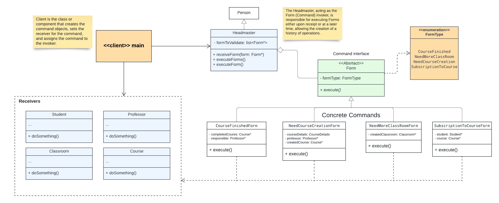
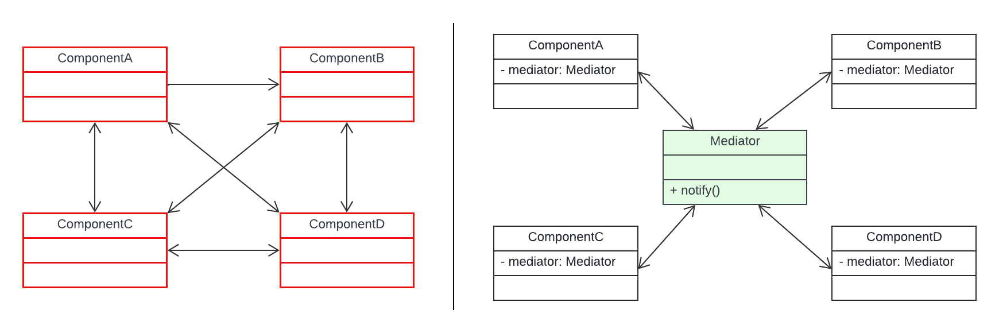
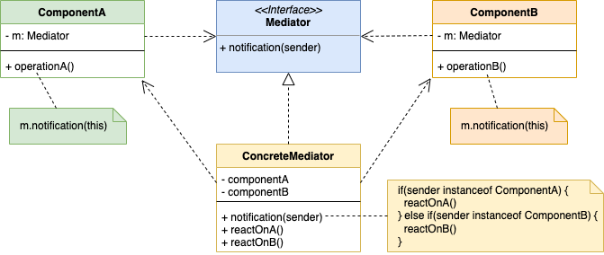

# Design Pattern

## Education Managamrent system


This diagram encapsulates the intricate relationships within an Education Management System. At its core is the Person base class, extending to specialized roles such as Student, Professor, Secretary, and HeadMaster. Importantly, both Secretary and Professor are designated as staff members, emphasizing their pivotal roles in the educational ecosystem. The HeadMaster also assumes a staff position, contributing to the administrative aspects of the system.

Parallelly, the Room base class orchestrates the aggregation of individuals within defined spaces. Subclasses such as Classroom and SecretarialOffice extend this hierarchy, aligning with distinct functionalities.

A critical element within the system is the Form class, intimately associated with subclasses of Staff. These staff members, including Secretary, Professor, and HeadMaster, are entrusted with the validation and execution of forms, which are subsequently stored within the SecretarialOffice.
Lastly, the Course class plays a pivotal role, encompassing a list of enrolled students, the responsible professor, and the associated classroom for the course.

<hr>

## What is a design pattern
As [Wikipedia](https://en.wikipedia.org/wiki/Software_design_pattern) defines, a "Design Pattern" is a general reusable solution to a commonly occurring problem within a given context in software design.

In other words, Design Patterns provide proven solutions to commonly occurring problems in software applications. Implementing a particular design pattern enhances flexibility, maintainability, and readability. Before implementing any design pattern, it's crucial to clearly understand the problem that the pattern can solve.

## How Design Patterns Help Us
While applications can be developed without implementing design patterns, doing so leads to challenges in changing, maintaining, or understanding the design as functionalities grow. Design Patterns help identify general issues and solve them in the best possible manner.

The first and most important step in working with Design Patterns is understanding the context and the exact issue in the application. Once the problem is identified, it becomes easier to determine which Design Pattern should be used to solve the identified problem.

### Creational Design Pattern
A creational design pattern deals with the process of object creation, providing mechanisms to create instances of classes in a flexible and efficient manner. These patterns abstract the instantiation process, making a system independent of how its objects are created, composed, and represented. One popular creational design pattern is the "Factory Method Pattern."

### Behavioral Design Pattern
Behavioral design patterns focus on the interaction and collaboration between objects, defining how they communicate, encapsulate responsibilities, and manage relationships. These patterns are concerned with algorithms and assignment of responsibilities between objects, promoting flexibility and maintainability in a system. An example of a behavioral design pattern is the "Observer Pattern."

<hr>

## Singleton Design pattern

Singleton design pattern is a creational design pattern that ensures a class has only one instance and provides a global point of access to that instance. In other words, it restricts the instantiation of a class to a single object, which can be accessed from anywhere in the application. This pattern is commonly used when you need to manage a shared resource, configuration settings, or a global state in a controlled manner.

<br>


### Intent
* Ensure that only one instance of a class is created.
* Provide a global point of access to the object

the problem that Singleton solve is when application needs **one**, and only one, instance of an object. Additionally, **lazy initialization** and **global access** are necessary.

## Implementation
The implementation involves a static member in the Singleton class which keeps the reference to the instance, a private constructor and a static public method that returns the static member reference.


## Factory Desing pattern
### Simple Factroy Pattern

**A factory is an object for creating other objects**. Simple Factory Pattern is a Factory class in its simplest form (In comparison to Factory Method Pattern or Abstract Factory Pattern). In another way, we can say: **In simple factory pattern, we have a factory class which has a method that returns different types of object based on given input.**

#### Intent
* creates objects without exposing the instantiation logic to the client.
* refers to the newly created object through a common interface

<hr>

## Command Design pattern
**Command** is a behavioral design pattern that turns a request into a stand-alone object that contains all information about the request. This transformation lets you pass requests as a method arguments, delay or queue a request’s execution, and support undoable operations.

### Intent
* encapsulate a request in an object
* allows the parameterization of clients with different requests
* allows saving the requests in a queue


Key Concepts:
The primary objective of the Command Design Pattern is to break the tight coupling between the sender of a request and the object responsible for executing that request. This decoupling is achieved through the introduction of a command interface, defining a method for executing a specific operation. Concrete command classes then implement this interface, encapsulating the operational details.

The pattern introduces an Invoker class, responsible for triggering the execution of a command. Remarkably, the invoker remains oblivious to the intricate details of how the command is executed. It merely invokes the command's execute method, exemplifying a clear separation of concerns that fosters flexibility and extensibility within the system.


**Key components of the Command Design Pattern:**

- **Command**: This is an interface or an abstract class that defines the common methods for executing a command, typically including an `execute()` method.
- **ConcreteCommand**: This class implements the Command interface and represents a specific command along with its parameters. It encapsulates the receiver object and binds the receiver with the action to be performed.
- **Receiver**: This class defines the operations that need to be performed when a command is executed. It knows how to carry out the request.
- **Invoker**: This class requests the command to carry out the action. It contains a reference to the command and can invoke the command when needed.
- **Client**: This is the class or component that creates the command objects, sets the receiver for the command, and assigns the command to the invoker.

### Code Example:
```c++

// Light bulb for example
class Receiver
{
private:
    bool    state;

public:
    Receiver() : state(false) {

    }

    void    turnOn() {
        state = true;
    }

    void    turnOff() {
        state = false;
    }
};

// Abstract Command class
class Command
{
/*data*/
public:
    virtual void    execute() = 0;
};

// Concrete Command
class   TurnOnCommand : public Command
{
private:
    Reciever    *receiver;

public:
    TurnOnCommand(Reciever *p_receiver) {
        this->receiver = p_receiver;
    }
    void    execute() {
        // some logic
        //...
        receiver->turnOn();
        //...
    }
};

class   TurnOffCommand()
{
private:
    Reciever    *receiver;

public:
    TurnOffCommand(Reciever *p_receiver) {
        this->receiver = p_receiver;
    }

    void    execute() {
        //...
        receiver->turnOff();
        //...
    }
};

// Light remote, for instance
class Invoker
{
private:
    // List to store commands, facilitating history tracking for potential
    // undo/redo operations and the ability to execute them later on
    std::list<Command>  commands;

public:
    receiveCommand(Command *cmd) {
        cmd.execute();
    
        // Store the executed command in the history list
        commands.push_back(cmd);
    }
};

// Client can be a class or component that create the command objects
int main(void)
{
    Receiver    *receiver = new Receiver();
    Command     *on_command = new TurnOnCommand(receiver);
    Command     *off_command = new TurnOffCommand(receiver);

    Invoker *invoker = new Invoker();

    inovker.receiveCommand(on_command);
    inovker.receiveCommand(off_command);

    delete  Invoker;
    delete  off_command;
    delete  on_command;
    delete  receiver;
    return (0);
}

```
This example illustrates a scenario involving a light bulb, demonstrating how the Command Design Pattern decouples the sender and receiver, allowing for dynamic and extensible command execution.

*By storing commands in the invoker, you create a history of operations. This history can be valuable for implementing features like undoing the last operation or redoing a previously undone operation. The stored commands serve as a record of the actions performed, providing a mechanism for managing the state and history of the application.*

### Indicating the action, not how it is done
the Command Design Pattern provides a valuable perspective that emphasizes indicating the action rather than delving into the intricacies of its execution. A command, such as TurnLightOn or StartCar, encapsulates a clear and intuitive representation of the intended action, fostering immediate comprehension. By utilizing commands, developers can shield the finer details of implementation, promoting a high-level understanding of the operation to be executed. This abstraction allows for a more intuitive and expressive design, enabling team members to collaborate effectively and enhancing the overall maintainability of the codebase. In essence, the Command Design Pattern empowers software architects to prioritize clarity and abstraction, emphasizing the "what" of an action over the "how."


### illustrating the subject example



---

# Mediator Design pattern
Well-designed enterprise applications follow the Single Responsibility principle, one of the SOLID principles, by using lightweight objects with clear responsibilities. While this method promotes modularity and clarity, the increasing number of small objects presents a communication challenge. As these objects grow in number, managing their interconnections becomes unwieldy. Moreover, direct communication between objects leads to tight coupling, contradicting the SOLID principles.

The Mediator Pattern establishes an intermediary object that encapsulates the communication and interaction logic between a these set of objects. By doing so, it promotes loose coupling, preventing objects from *directly referencing* each other. This design principle allows the interaction dynamics among objects to evolve independently, enhancing flexibility. In practical terms, this implies that objects communicate by sending messages to the mediator, which then efficiently routes or redirects these messages to the appropriate object handlers, facilitating a well-organized and decoupled system.



## Participants of the Mediator Pattern

I appreciate John Thompson's in-depth exploration of the Mediator Pattern in his article titled [The Mediator Pattern: Deep Dive](https://dzone.com/articles/mediator-pattern-1):

In a simulated scenario resembling a war zone, where armed units are deployed into enemy territory, various unit types, including soldiers, tanks, grenadiers, and snipers, form a strategic framework. The adopted strategy mandates that when one unit initiates an attack, all other units should stop their attacks and take cover. Achieving this coordination in the programming realm involves creating distinct classes for each armed unit. Within each class, the logic is implemented to notify objects of other classes when an attack is ready to take place.

However, the challenge arises when new units are introduced or when battle tactics evolve, requiring substantial updates to existing classes. To address this, a real-life analogy is employed – introducing a Commander as a mediator. In this analogy, all units refrain from direct communication with each other and instead interact with the Commander. The Commander, informed by notifications from certain units, can then issue requests to one or more other units to perform actions as dictated by the requirements.

The implementation of this mediator role is modeled through a `Commander interface` and a concrete `CommanderImpl` subclass. The `Commander interface` defines methods for sending messages to objects representing armed units, as well as methods that armed unit objects can employ to communicate with the Commander. The `CommanderImpl` subclass, in turn, maintains a reference to the objects representing armed units and overrides the methods of the `Commander interface`. In this example, an `ArmedUnit interface` is introduced, and its implementing classes, `SoldierUnit` and `TankUnit`, represent specific armed units. Both `SoldierUnit` and `TankUnit` hold references to the Commander.

Analyzing this example within the context of the Mediator pattern, the key participants are identified:
* **Mediator** (Commander): An interface declaring methods for communication with Colleague objects.
* **ConcreteMediator** (CommanderImpl): Implements the Mediator interface and coordinates Colleague objects.
* **Colleague** (SoldierUnit and TankUnit): Communicates with its Mediator when their state changes and responds to requests from the Mediator.



---

# Observer Design Pattern


<br>

---

# Links

* <a href="https://www.javier8a.com/itc/bd1/articulo.pdf">Design Patterns - GOF</a>
* <a href="https://www.patterns.dev/">Patterns.dev</a>

#### Singleton Design Pattern

* <a href="https://www.oodesign.com/singleton-pattern">Singleton design pattern (OODesign)</a>

* <a href="https://medium.com/geekculture/overview-of-singleton-design-pattern-10b2b18bfd11">Singleton design pattern</a>

* <a href="https://medium.com/@leogbastiani/singleton-vs-global-variables-choosing-the-best-structure-for-your-code-ed25aec3e9f9">Singleton vs global variables</a>

* <a href="https://www.youtube.com/watch?v=hUE_j6q0LTQ">Singleton Pattern (Christopher Okhrav) Video</a>
* <a href="https://jorudolph.wordpress.com/2009/11/22/singleton-considerations/">What is so bad about Singletons?</a>


#### Command Design Pattern

* <a href="https://www.oodesign.com/command-pattern">Command Design pattern - oodesign</a>
* <a href="https://refactoring.guru/design-patterns/command">Command Pattern (refactoring guru)</a>
* <a href="https://stackoverflow.com/questions/32597736/why-should-i-use-the-command-design-pattern-while-i-can-easily-call-required-met">why should i use the command design pattern</a>
* <a href="https://course.ccs.neu.edu/cs5004/lecturecommands.html">The Command Design Pattern</a>
* <a href="https://bootcamp.uxdesign.cc/encapsulating-requests-the-power-of-the-command-design-pattern-d2f42b0f9d1d">Encapsulating Requests: The Power of the “Command Design Pattern”</a>
* <a href="https://www.youtube.com/watch?v=LRZ1cuXiXTI">Undo and Redo, Command design pattern </a>

#### Mediator Design Pattern

* <a href="https://dzone.com/articles/mediator-pattern-1">The Mediator Pattern: Deep Dive</a>
* <a href="https://www.oodesign.com/mediator-pattern">Mediator Pettern - oodesign</a>
* <a href="https://refactoring.guru/design-patterns/mediator">Mediator Pettern - refactoring.guru</a>

#### Observer Design Pattern

* <a href="https://www.cs.unc.edu/~stotts/GOF/hires/pat5gfso.htm">Observer Design pattern</a>


#### Facade Design Pattern

* <a href="https://www.cs.unc.edu/~stotts/GOF/hires/pat4efso.htm">Facade Design Pattern - *Recommended </a>
