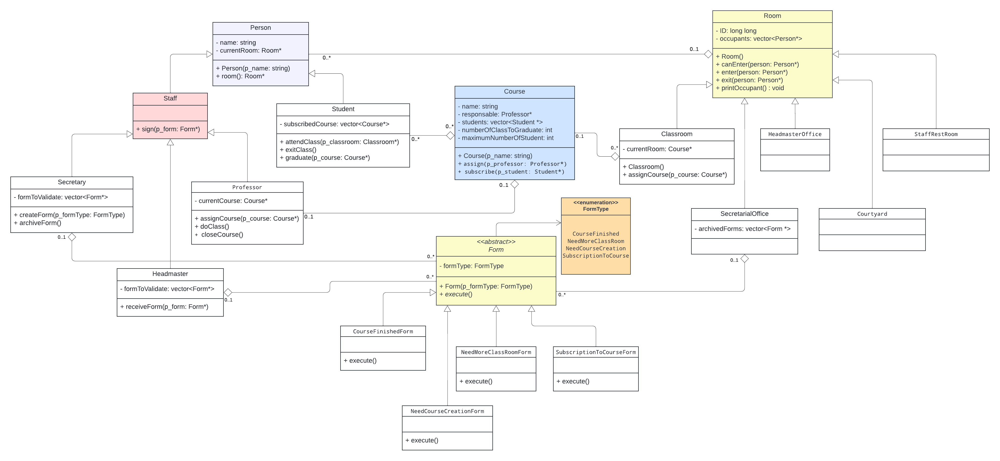
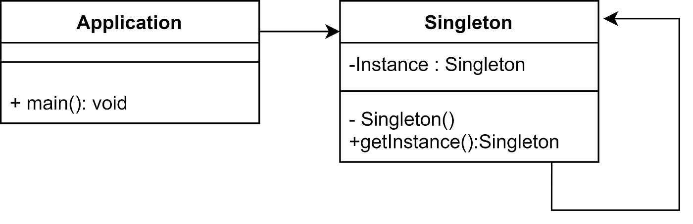
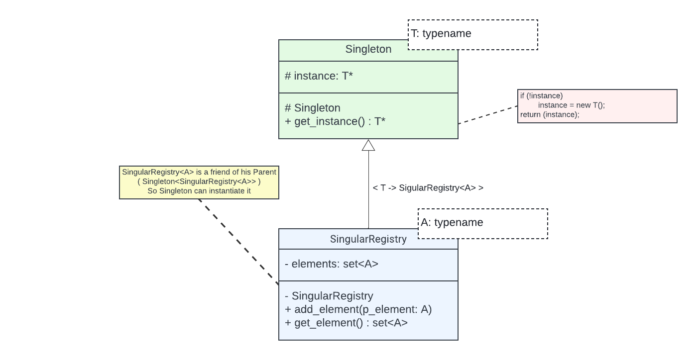
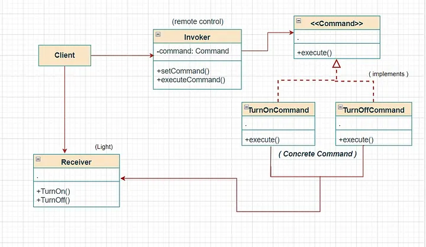

# Design Pattern

## Education Managamrent system


This diagram encapsulates the intricate relationships within an Education Management System. At its core is the Person base class, extending to specialized roles such as Student, Professor, Secretary, and HeadMaster. Importantly, both Secretary and Professor are designated as staff members, emphasizing their pivotal roles in the educational ecosystem. The HeadMaster also assumes a staff position, contributing to the administrative aspects of the system.

Parallelly, the Room base class orchestrates the aggregation of individuals within defined spaces. Subclasses such as Classroom and SecretarialOffice extend this hierarchy, aligning with distinct functionalities.

A critical element within the system is the Form class, intimately associated with subclasses of Staff. These staff members, including Secretary, Professor, and HeadMaster, are entrusted with the validation and execution of forms, which are subsequently stored within the SecretarialOffice.
Lastly, the Course class plays a pivotal role, encompassing a list of enrolled students, the responsible professor, and the associated classroom for the course.

<hr>

## What is a design pattern
As <a href="https://en.wikipedia.org/wiki/Software_design_pattern">wikipedia</a> says, "Design pattern is a general reusable solution to a commonly occurring problem within a given context in software design"

In other words, we can say that Design Pattern provides proven solution to solve commonly occurring problems in software (generally big) applications. Implementation of a particular design pattern in any application increases flexibility, maintainability and readability of the application. Before implementing any design pattern in the application, first we should be clear about the problem that can be solved by a particular design pattern.

## How Design Patterns Help Us
Application can be developed without implementing design patterns. Without using design pattern, initially application development time will be less but as application functionalities grow, you will realize that it is very difficult to change, maintain or understand the design. That’s where Design Pattern helps us to identify a general issue and solve it in the best possible manner.

The first and most important part while working with Design Patterns is to understand the context and exact issue in application. Once the problem is identified, then it is easy to figure out which Design Pattern should be used to solve indentified problem.

<hr>

## Singleton Design pattern

Singleton design pattern is a creational design pattern that ensures a class has only one instance and provides a global point of access to that instance. In other words, it restricts the instantiation of a class to a single object, which can be accessed from anywhere in the application. This pattern is commonly used when you need to manage a shared resource, configuration settings, or a global state in a controlled manner.

<br>




### Intent
* Ensure that only one instance of a class is created.
* Provide a global point of access to the object

the problem that Singleton solve is when application needs **one**, and only one, instance of an object. Additionally, **lazy initialization** and **global access** are necessary.

## Implementation
The implementation involves a static member in the Singleton class which keeps the reference to the instance, a private constructor and a static public method that returns the static member reference.




## Factory Desing pattern
### Simple Factroy Pattern

**A factory is an object for creating other objects**. Simple Factory Pattern is a Factory class in its simplest form (In comparison to Factory Method Pattern or Abstract Factory Pattern). In another way, we can say: **In simple factory pattern, we have a factory class which has a method that returns different types of object based on given input.**

#### Intent
* creates objects without exposing the instantiation logic to the client.
* refers to the newly created object through a common interface

<hr>

## Command Design pattern
**Command** is a behavioral design pattern that turns a request into a stand-alone object that contains all information about the request. This transformation lets you pass requests as a method arguments, delay or queue a request’s execution, and support undoable operations.

### Intent
* encapsulate a request in an object
* allows the parameterization of clients with different requests
* allows saving the requests in a queue


Key Concepts:
The primary objective of the Command Design Pattern is to break the tight coupling between the sender of a request and the object responsible for executing that request. This decoupling is achieved through the introduction of a command interface, defining a method for executing a specific operation. Concrete command classes then implement this interface, encapsulating the operational details.

The pattern introduces an Invoker class, responsible for triggering the execution of a command. Remarkably, the invoker remains oblivious to the intricate details of how the command is executed. It merely invokes the command's execute method, exemplifying a clear separation of concerns that fosters flexibility and extensibility within the system.



**Key components of the Command Design Pattern:**

* **Command**: This is an interface or an abstract class that defines the common methods for executing a command, typically including an execute() method.
* **ConcreteCommand**: This class implements the Command interface and represents a specific command along with its parameters. It encapsulates the receiver object and binds the receiver with the action to be performed.
* **Receiver**: This class defines the operations that need to be performed when a command is executed. It knows how to carry out the request.
* **Invoker**: This class requests the command to carry out the action. It contains a reference to the command and can invoke the command when needed.
* **Client**: This is the class or component that creates the command objects, sets the receiver for the command, and assigns the command to the invoker.

### Code Example:
```c++

// Light bulb for example
class Receiver
{
private:
    bool    state;

public:
    Receiver() : state(false) {

    }

    void    turnOn() {
        state = true;
    }

    void    turnOff() {
        state = false;
    }
};

// Abstract Command class
class Command
{
/*data*/
public:
    virtual void    execute() = 0;
};

// Concrete Command
class   TurnOnCommand : public Command
{
private:
    Reciever    *receiver;

public:
    TurnOnCommand(Reciever *p_receiver) {
        this->receiver = p_receiver;
    }
    void    execute() {
        // some logic
        //...
        receiver->turnOn();
        //...
    }
};

class   TurnOffCommand()
{
private:
    Reciever    *receiver;

public:
    TurnOffCommand(Reciever *p_receiver) {
        this->receiver = p_receiver;
    }

    void    execute() {
        //...
        receiver->turnOff();
        //...
    }
};

// Light remote, for instance
class Invoker
{
private:
    // List to store commands, facilitating history tracking for potential
    // undo/redo operations and the ability to execute them later on
    std::list<Command>  commands;

public:
    receiveCommand(Command *cmd) {
        cmd.execute();
    
        // Store the executed command in the history list
        commands.push_back(cmd);
    }
};

// Client can be a class or component that create the command objects
int main(void)
{
    Receiver    *receiver = new Receiver();
    Command     *on_command = new TurnOnCommand(receiver);
    Command     *off_command = new TurnOffCommand(receiver);

    Invoker *invoker = new Invoker();

    inovker.receiveCommand(on_command);
    inovker.receiveCommand(off_command);

    delete  Invoker;
    delete  off_command;
    delete  on_command;
    delete  receiver;
    return (0);
}

```
This example illustrates a scenario involving a light bulb, demonstrating how the Command Design Pattern decouples the sender and receiver, allowing for dynamic and extensible command execution.

By storing commands in the invoker, you create a history of operations. This history can be valuable for implementing features like undoing the last operation or redoing a previously undone operation. The stored commands serve as a record of the actions performed, providing a mechanism for managing the state and history of the application.


# Links
<a href="https://www.oodesign.com/singleton-pattern">Singleton design pattern (OODesign)</a>
<br>
<a href="https://medium.com/geekculture/overview-of-singleton-design-pattern-10b2b18bfd11">Singleton design pattern</a>
<br>
<a hre="https://medium.com/@leogbastiani/singleton-vs-global-variables-choosing-the-best-structure-for-your-code-ed25aec3e9f9">Singleton vs global variables</a>
<br>
https://www.youtube.com/watch?v=hUE_j6q0LTQ